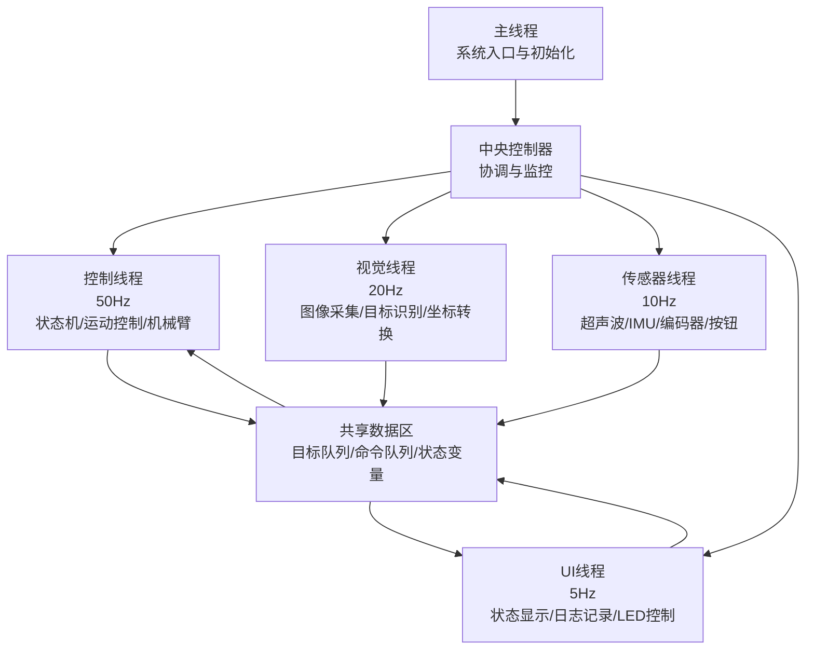
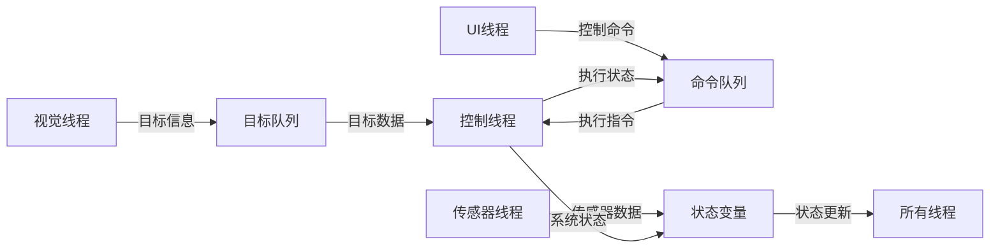
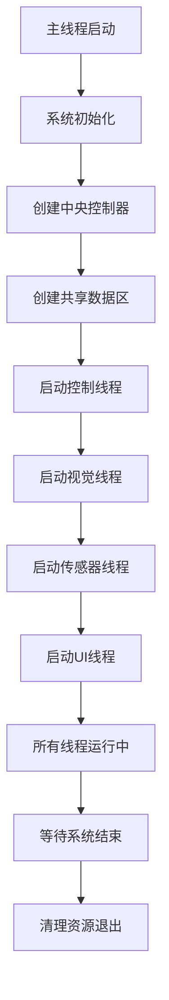

# 基于树莓派的视觉引导移动操作机器人：构建与控制逻辑

## 摘要
本文介绍了一种基于树莓派的视觉引导移动操作机器人系统的完整构建方案。系统整合了树莓派4B作为主控制器，OpenCV计算机视觉模块，机械臂与移动底盘，实现了目标识别、定位抓取和自主移动的闭环控制。本文详细阐述了硬件选型、软件架构、视觉处理算法、运动控制逻辑以及系统集成方法。

**关键词**：树莓派；计算机视觉；机械臂控制；移动机器人；ROS；OpenCV

---

## 1. 引言
随着嵌入式计算能力的提升和开源硬件生态的成熟，构建功能复杂的智能机器人系统已成为创客和研究人员可行的目标。树莓派以其出色的性价比、完善的GPIO接口和活跃的社区支持，成为机器人开发的首选平台之一。

本文所述项目旨在构建一个能够通过视觉识别目标物体，自主导航至目标位置，并操作机械手完成抓取任务的移动机器人。该系统综合体现了感知、决策与执行三个核心机器人技术模块，具有较高的教学与研究价值。


## 2. 系统线程架构



### 2.1 线程功能详表

| 线程名称 | 执行频率 | 主要功能 | 优先级 | 依赖关系 |
|---------|----------|----------|--------|----------|
| **主线程** | 一次性 | 系统初始化、启动所有线程、用户命令处理 | - | 无 |
| **中央控制器** | 持续运行 | 线程协调、状态监控、资源管理 | - | 所有线程 |
| **控制线程** | 50Hz (20ms) | 状态机处理、运动控制、机械臂控制、任务执行 | 最高 | 视觉线程、传感器线程 |
| **视觉线程** | 20Hz (50ms) | 图像采集、目标识别、坐标计算、数据滤波 | 高 | 无 |
| **传感器线程** | 10Hz (100ms) | 超声波测距、IMU数据、编码器读取、按钮检测 | 中 | 无 |
| **UI/状态线程** | 5Hz (200ms) | 状态显示、日志记录、LED控制、用户交互 | 低 | 所有线程 |
| **共享数据区** | 实时访问 | 目标队列、命令队列、状态变量同步 | - | 所有线程 |

### 2.2 线程间通信




### 2.3 线程启动顺序



### 2.4 关键特性说明

1. **多线程并行**：四个工作线程独立运行，提高系统响应速度
2. **优先级分层**：控制线程优先级最高，确保实时性
3. **数据共享**：通过共享数据区安全交换信息
4. **频率差异化**：不同任务根据需求设置不同执行频率
5. **中央协调**：中央控制器统一管理和监控所有线程

### 2.5 代码实现框架

```python
# 主线程
class MainThread:
    def __init__(self):
        self.controller = CentralController()
        
    def start(self):
        self.controller.initialize()
        self.controller.start_all_threads()
        
    def shutdown(self):
        self.controller.stop_all_threads()

# 中央控制器
class CentralController:
    def start_all_threads(self):
        # 启动顺序：控制线程 -> 视觉线程 -> 传感器线程 -> UI线程
        self.control_thread.start()   # 50Hz
        self.vision_thread.start()    # 20Hz
        self.sensor_thread.start()    # 10Hz
        self.ui_thread.start()        # 5Hz
        
    def stop_all_threads(self):
        # 停止顺序：UI线程 -> 传感器线程 -> 视觉线程 -> 控制线程
        self.ui_thread.stop()
        self.sensor_thread.stop()
        self.vision_thread.stop()
        self.control_thread.stop()
```


## 3. 视觉模块设计与实现

### 3.1 摄像头标定
获取摄像头的内参矩阵和畸变系数，是进行精确定位的前提。
```python
import cv2
import numpy as np

# 示例：使用棋盘格进行标定
def calibrate_camera(images, pattern_size=(9,6)):
    objpoints = []  # 3D点（世界坐标系）
    imgpoints = []  # 2D点（图像坐标系）
    
    # 生成对象点 (0,0,0), (1,0,0), (2,0,0) ....
    objp = np.zeros((pattern_size[0]*pattern_size[1], 3), np.float32)
    objp[:,:2] = np.mgrid[0:pattern_size[0], 0:pattern_size[1]].T.reshape(-1,2)
    
    for img in images:
        gray = cv2.cvtColor(img, cv2.COLOR_BGR2GRAY)
        ret, corners = cv2.findChessboardCorners(gray, pattern_size, None)
        if ret:
            objpoints.append(objp)
            imgpoints.append(corners)
    
    ret, mtx, dist, rvecs, tvecs = cv2.calibrateCamera(objpoints, imgpoints, gray.shape[::-1], None, None)
    return mtx, dist
```

### 3.2 目标识别与定位
采用颜色阈值分割与轮廓检测方法，结合PNP解算获得目标相对于摄像头的位置。
```python
def detect_and_locate(frame, camera_matrix, dist_coeffs):
    # 转换为HSV颜色空间，进行颜色过滤
    hsv = cv2.cvtColor(frame, cv2.COLOR_BGR2HSV)
    lower_color = np.array([25, 50, 50])  # 示例：黄色下限
    upper_color = np.array([35, 255, 255]) # 黄色上限
    mask = cv2.inRange(hsv, lower_color, upper_color)
    
    # 形态学操作去除噪声
    kernel = np.ones((5,5), np.uint8)
    mask = cv2.morphologyEx(mask, cv2.MORPH_OPEN, kernel)
    
    # 查找轮廓
    contours, _ = cv2.findContours(mask, cv2.RETR_EXTERNAL, cv2.CHAIN_APPROX_SIMPLE)
    
    if contours:
        # 找到最大轮廓
        largest_contour = max(contours, key=cv2.contourArea)
        if cv2.contourArea(largest_contour) > 500:  # 面积阈值
            # 获取最小外接矩形
            rect = cv2.minAreaRect(largest_contour)
            box = cv2.boxPoints(rect)
            box = np.int0(box)
            
            # 已知目标物体尺寸（单位：米）
            object_points = np.array([
                [-0.05, -0.05, 0],
                [0.05, -0.05, 0],
                [0.05, 0.05, 0],
                [-0.05, 0.05, 0]
            ], dtype=np.float32)
            
            # 解算位姿（假设目标在平面Z=0上）
            ret, rvec, tvec = cv2.solvePnP(object_points, box.astype(np.float32), 
                                          camera_matrix, dist_coeffs)
            return True, rvec, tvec, box
    return False, None, None, None
```

## 4. 运动控制模块

### 4.1 移动底盘控制逻辑
采用差分驱动模型，实现基于目标点的位置控制。
```python
class MobileBaseController:
    def __init__(self, wheel_radius, wheel_base):
        self.wheel_radius = wheel_radius
        self.wheel_base = wheel_base  # 两轮间距
        
    def calculate_wheel_speeds(self, linear_x, angular_z):
        """
        根据线速度和角速度计算左右轮转速
        """
        left_speed = linear_x - (angular_z * self.wheel_base) / 2.0
        right_speed = linear_x + (angular_z * self.wheel_base) / 2.0
        
        # 转换为PWM占空比
        left_pwm = left_speed / self.wheel_radius
        right_pwm = right_speed / self.wheel_radius
        
        return left_pwm, right_pwm
    
    def navigate_to_point(self, current_pose, target_point, kp_linear=0.5, kp_angular=1.0):
        """
        简单的P控制导航到目标点
        """
        dx = target_point[0] - current_pose[0]
        dy = target_point[1] - current_pose[1]
        distance = np.sqrt(dx**2 + dy**2)
        
        # 目标朝向角
        target_angle = np.arctan2(dy, dx)
        angle_error = target_angle - current_pose[2]
        
        # 归一化角度误差到[-pi, pi]
        angle_error = np.arctan2(np.sin(angle_error), np.cos(angle_error))
        
        # 计算控制量
        linear_speed = kp_linear * distance
        angular_speed = kp_angular * angle_error
        
        return linear_speed, angular_speed
```

### 4.2 机械臂逆运动学与控制
以机械臂为例，实现简单的几何法逆解。
```python
import math

class Simple6DOFIK:
    def __init__(self, link_lengths):
        self.l1, self.l2, self.l3 = link_lengths
        
    def calculate_angles(self, target_position):
        x, y, z = target_position
        
        # 关节1：基座旋转（绕Z轴）
        theta1 = math.atan2(y, x)
        
        # 投影到平面上的距离
        r = math.sqrt(x**2 + y**2) - self.l1
        d = math.sqrt(r**2 + z**2)
        
        # 余弦定理求解关节2和3
        # 这里省略详细推导，实际需根据机械臂具体结构实现
        # 返回关节角度列表
        return [theta1, theta2, theta3, 0, 0, 0]  # 示例返回值
```

## 5. 系统集成与控制逻辑

### 5.1 状态机设计
使用有限状态机管理机器人的工作流程，确保任务有序执行。
```python
from enum import Enum

class RobotState(Enum):
    IDLE = 0
    SEARCHING = 1
    APPROACHING = 2
    ALIGNING = 3
    GRASPING = 4
    RETREATING = 5
    ERROR = 99

class RobotController:
    def __init__(self):
        self.state = RobotState.IDLE
        self.target_position = None
        
    def run(self):
        while True:
            if self.state == RobotState.IDLE:
                self.state = RobotState.SEARCHING
                
            elif self.state == RobotState.SEARCHING:
                # 寻找目标
                found, rvec, tvec, _ = detect_and_locate(frame, mtx, dist)
                if found:
                    self.target_position = tvec.flatten()
                    self.state = RobotState.APPROACHING
                    
            elif self.state == RobotState.APPROACHING:
                # 移动至目标附近
                distance = np.linalg.norm(self.target_position)
                if distance < 0.3:  # 30cm内
                    self.state = RobotState.ALIGNING
                else:
                    # 发送移动指令
                    linear_speed = min(0.2, distance * 0.5)
                    # ... 控制底盘移动
                    
            elif self.state == RobotState.ALIGNING:
                # 精确对准目标
                # ... 精确控制逻辑
                if aligned:
                    self.state = RobotState.GRASPING
                    
            elif self.state == RobotState.GRASPING:
                # 执行抓取
                arm_angles = arm_ik.calculate_angles(self.target_position)
                # ... 控制机械臂
                if grasp_success:
                    self.state = RobotState.RETREATING
                    
            # ... 其他状态处理
            
            time.sleep(0.1)  # 控制循环频率
```


### 5.2 四轮电机控制
```python
import smbus
import time
import struct

# 设置I2C总线号，通常为1
I2C_BUS = 1

# 设置四路电机驱动模块的I2C地址
MOTOR_ADDR = 0x34 

# 寄存器地址
ADC_BAT_ADDR = 0x00
MOTOR_TYPE_ADDR = 0x14 #编码电机类型设置
MOTOR_ENCODER_POLARITY_ADDR = 0x15 #设置编码方向极性，
#如果发现电机转速根本不受控制，要么最快速度转动，要么停止。可以将此地址的值重新设置一下
#范围0或1，默认0
MOTOR_FIXED_PWM_ADDR = 0x1F #固定PWM控制，属于开环控制,范围（-100~100）   
MOTOR_FIXED_SPEED_ADDR = 0x33 #固定转速控制，属于闭环控制，
#单位：脉冲数每10毫秒，范围（根据具体的编码电机来，受编码线数，电压大小，负载大小等影响，一般在±50左右）

MOTOR_ENCODER_TOTAL_ADDR = 0x3C #4个编码电机各自的总脉冲值
# #如果已知电机每转一圈的脉冲数为U，又已知轮子的直径D，那么就可以通过脉冲计数的方式得知每个轮子行进的距离
# #比如读到电机1的脉冲总数为P，那么行进的距离为(P/U) * (3.14159*D)
# #对于不同的电机可以自行测试每圈的脉冲数U，可以手动旋转10圈读出脉冲数，然后取平均值得出


#电机类型具体值
MOTOR_TYPE_WITHOUT_ENCODER = 0
MOTOR_TYPE_TT = 1
MOTOR_TYPE_N20 = 2
MOTOR_TYPE_JGB37_520_12V_110RPM = 3 #磁环每转是44个脉冲   减速比:90  默认

#电机类型及编码方向极性
MotorType = MOTOR_TYPE_N20
MotorEncoderPolarity = 0

bus = smbus.SMBus(I2C_BUS)
speed1 = [20,20,20,20]
speed2 = [-20,-20,-20,-20]
speed3 = [0,0,0,0]

pwm1 = [50,50,50,50]
pwm2 = [-100,-100,-100,-100]
pwm3 = [0,0,0,0]

def Motor_Init(): #电机初始化
    bus.write_byte_data(MOTOR_ADDR, MOTOR_TYPE_ADDR, MotorType)  #设置电机类型
    time.sleep(0.5)
    bus.write_byte_data(MOTOR_ADDR, MOTOR_ENCODER_POLARITY_ADDR, MotorEncoderPolarity)  #设置编码极性

def main():
    while True:
      battery = bus.read_i2c_block_data(MOTOR_ADDR, ADC_BAT_ADDR)
      print("V = {0}mV".format(battery[0]+(battery[1]<<8)))
      
      Encode = struct.unpack('iiii',bytes(bus.read_i2c_block_data(MOTOR_ADDR, MOTOR_ENCODER_TOTAL_ADDR,16)))
      
      print("Encode1 = {0}  Encode2 = {1}  Encode3 = {2}  Encode4 = {3}".format(Encode[0],Encode[1],Encode[2],Encode[3]))
      
      #PWM控制（注意：PWM控制是一个持续控制的过程，若有延时则会打断电机的运行）
      #bus.write_i2c_block_data(MOTOR_ADDR, MOTOR_FIXED_PWM_ADDR,pwm1)
      
      
      #固定转速控制
      bus.write_i2c_block_data(MOTOR_ADDR, MOTOR_FIXED_SPEED_ADDR,speed1)
      time.sleep(3)
      bus.write_i2c_block_data(MOTOR_ADDR, MOTOR_FIXED_SPEED_ADDR,speed2)
      time.sleep(3)
      bus.write_i2c_block_data(MOTOR_ADDR, MOTOR_FIXED_SPEED_ADDR,speed3)
      time.sleep(3)


if __name__ == "__main__":
    Motor_Init()
    main()
```

### 5.3 舵机控制
```python
# USB手柄控制麦轮电机和舵机云台整合程序
# 功能：左摇杆控制四个麦轮运动（左移=向左漂移、右移=向右漂移），右摇杆控制水平/竖直舵机，XABY键控制特定方向（X=左转、B=右转）
import pygame
import sys
import time
import smbus
import struct
import os  # 用于执行系统命令检查库是否安装
from pygame.locals import *

# 检查并安装必要的舵机控制库
try:
    from adafruit_servokit import ServoKit
    import board
    import busio
except ImportError:
    print("⚠️ 检测到缺少必要的舵机控制库，正在尝试安装...")
    os.system("pip3 install adafruit-circuitpython-servokit")
    os.system("pip3 install adafruit-blinka")
    from adafruit_servokit import ServoKit
    import board
    import busio

# -------------------------- 1. 电机驱动配置（I2C总线） --------------------------
MOTOR_I2C_BUS = 1
MOTOR_ADDR = 0x34 

# 电机驱动寄存器地址定义
ADC_BAT_ADDR = 0x00                  # 电池电压检测寄存器
MOTOR_TYPE_ADDR = 0x14               # 电机类型设置寄存器
MOTOR_ENCODER_POLARITY_ADDR = 0x15   # 编码器方向极性寄存器
MOTOR_FIXED_SPEED_ADDR = 0x33        # 固定转速转速控制寄存器
MOTOR_ENCODER_TOTAL_ADDR = 0x3C      # 编码器总脉冲计数寄存器

# 电机类型定义
MOTOR_TYPE_WITHOUT_ENCODER = 0
MOTOR_TYPE_TT = 1
MOTOR_TYPE_N20 = 2  # N20编码电机
MOTOR_TYPE_JGB37_520 = 3

# 电机初始化参数
MotorType = MOTOR_TYPE_N20            # 使用N20编码电机
MotorEncoderPolarity = 0              # 编码器极性
MAX_MOTOR_SPEED = 30                  # 电机最大转速
TURN_IN_PLACE_SCALE = 1.0             # 原地转弯速度比例
KEY_PRESS_SPEED = 20                  # 按键控制时的固定速度
TURN_SMOOTHING_FACTOR = 0.2           # 转向平滑因子，减少卡顿
motor_bus = smbus.SMBus(MOTOR_I2C_BUS)# 初始化电机I2C总线

# 新增：用于平滑处理的变量
last_rotate = 0.0                     # 上一次的旋转分量


# -------------------------- 2. 舵机云台配置 --------------------------
SERVO_I2C_BUS = 1  # 与电机相同的I2C总线号
SERVO_ADDR = 0x40   # 舵机驱动板默认地址

# 1. 水平舵机（TA90S，通道0，360°连续旋转）
HORIZONTAL_CH = 0
H_STOP_MIN = 116          # 停止区间下限
H_STOP_MAX = 126          # 停止区间上限
H_STOP = 121              # 停止角度（区间中间值）
H_CW_ANGLE = 140          # 顺时针旋转角度
H_CCW_ANGLE = 100         # 逆时针旋转角度

# 2. 竖直舵机（180°角度舵机，通道1，上下运动）
VERTICAL_CH = 1
V_MIN = 0                 # 向上极限角度
V_MAX = 180               # 向下极限角度
V_MID = 90                # 中间位置
V_ROCKER_STEP = 1         # 摇杆控制的步长


# -------------------------- 3. 手柄配置与参数 --------------------------
# 轴定义
AXIS_LEFT_X = 0   # 左摇杆X轴：左右漂移控制（左移=向左漂移，右移=向右漂移）
AXIS_LEFT_Y = 1   # 左摇杆Y轴：前后移动控制
AXIS_RIGHT_Y = 3  # 右摇杆Y轴：上下控制竖直舵机
AXIS_RIGHT_X = 2  # 右摇杆X轴：左右控制水平舵机

# 按键定义 - 功能映射（按键本身定义不变，功能调整）
X_BUTTON = 3         # X键：左转
B_BUTTON = 1         # B键：右转
Y_BUTTON = 4         # Y键：前进
A_BUTTON = 0         # A键：后退
BUTTON10 = 10        # 按键10：水平左移
BUTTON11 = 11        # 按键11：水平右移

# 控制参数
ROCKER_THRESHOLD = 0.15   # 降低阈值，提高灵敏度
MIXED_MOVEMENT_SCALE = 0.7 # 混合运动时的速度缩放比例，避免电机过载
LAST_BUTTON_STATE = [False, False, False, False, False, False]  # 记录上一次按键状态（Y/A/B/X/按键10/按键11）


# -------------------------- 4. 全局变量 --------------------------
current_h_angle = H_STOP    # 当前水平舵机角度
current_v_angle = V_MID     # 当前竖直舵机角度
h_rotating = False          # 水平舵机是否正在旋转


# -------------------------- 5. 电机控制函数 --------------------------
def motor_init():
    """电机驱动模块初始化（设置电机类型和编码器极性）"""
    motor_bus.write_byte_data(MOTOR_ADDR, MOTOR_TYPE_ADDR, MotorType)
    time.sleep(0.5)  # 等待设置生效
    motor_bus.write_byte_data(MOTOR_ADDR, MOTOR_ENCODER_POLARITY_ADDR, MotorEncoderPolarity)
    print("✅ 电机驱动初始化完成")


def set_motor_speed(speed1, speed2, speed3, speed4):
    """
    设置4个电机的转速（闭环控制）
    参数：speed1~speed4 分别对应4个电机的转速（-MAX_MOTOR_SPEED ~ MAX_MOTOR_SPEED）
    麦轮布局：M1=右前轮(B轮), M2=左前轮(A轮), M3=右后轮(A轮), M4=左后轮(B轮)
    """
    # 限制转速范围
    speed1 = max(-MAX_MOTOR_SPEED, min(MAX_MOTOR_SPEED, speed1))
    speed2 = max(-MAX_MOTOR_SPEED, min(MAX_MOTOR_SPEED, speed2))
    speed3 = max(-MAX_MOTOR_SPEED, min(MAX_MOTOR_SPEED, speed3))
    speed4 = max(-MAX_MOTOR_SPEED, min(MAX_MOTOR_SPEED, speed4))
    
    # 转换为字节列表并发送
    speed_list = [int(speed1), int(speed2), int(speed3), int(speed4)]
    motor_bus.write_i2c_block_data(MOTOR_ADDR, MOTOR_FIXED_SPEED_ADDR, speed_list)


def read_motor_state():
    """读取电机状态（电池电压 + 编码器脉冲数）并打印"""
    # 读取电池电压
    battery = motor_bus.read_i2c_block_data(MOTOR_ADDR, ADC_BAT_ADDR)
    battery_voltage = battery[0] + (battery[1] << 8)
    
    # 读取编码器数据
    encoder_data = motor_bus.read_i2c_block_data(MOTOR_ADDR, MOTOR_ENCODER_TOTAL_ADDR, 16)
    encode1, encode2, encode3, encode4 = struct.unpack('iiii', bytes(encoder_data))
    
    # 打印状态
    return f"电池电压：{battery_voltage}mV | 编码器(M1-M4)：[{encode1}, {encode2}, {encode3}, {encode4}]"


# -------------------------- 6. 舵机控制函数 --------------------------
def init_servos():
    """初始化舵机驱动板和舵机（与电机共用I2C总线）"""
    try:
        # 与电机使用相同的I2C总线（GPIO2=SDA, GPIO3=SCL）
        valid_ports = {
            0: (board.D1, board.D0),  # I2C0对应的引脚
            1: (board.D3, board.D2)   # I2C1对应的引脚 (GPIO3=SCL, GPIO2=SDA)
        }
        
        if SERVO_I2C_BUS in valid_ports:
            scl_pin, sda_pin = valid_ports[SERVO_I2C_BUS]
            i2c = busio.I2C(scl_pin, sda_pin)
        else:
            raise ValueError(f"不支持的I2C总线号: {SERVO_I2C_BUS}")
        
        # 等待I2C连接就绪
        while not i2c.try_lock():
            pass
        
        try:
            # 扫描I2C总线上的设备
            devices = i2c.scan()
            if not devices:
                print("⚠️ 未在I2C总线上发现任何设备")
            else:
                print(f"✅ 在I2C总线上发现设备: {[hex(d) for d in devices]}")
                if SERVO_ADDR not in devices:
                    print(f"⚠️ 未发现舵机驱动板（预期地址: {hex(SERVO_ADDR)}）")
                if MOTOR_ADDR not in devices:
                    print(f"⚠️ 未发现电机驱动板（预期地址: {hex(MOTOR_ADDR)}）")
        finally:
            i2c.unlock()
        
        kit = ServoKit(channels=16, i2c=i2c, address=SERVO_ADDR)
        print("✅ 使用adafruit_servokit初始化舵机成功")
        return kit
    
    except Exception as e:
        print(f"❌ 舵机初始化失败: {str(e)}")
        print("请检查以下事项：")
        print("1. 确保已正确启用I2C1: sudo raspi-config")
        print("2. 确保设备正确连接到I2C1 (GPIO2=SDA, GPIO3=SCL)")
        print("3. 手动安装必要的库:")
        print("   pip3 install adafruit-circuitpython-servokit")
        print("   pip3 install adafruit-blinka")
        print("   pip3 install smbus2")
        sys.exit(1)


def control_horizontal(kit, action):
    """控制水平舵机：支持启动和停止旋转"""
    global current_h_angle, h_rotating
    
    if action == "stop":
        if h_rotating:
            kit.servo[HORIZONTAL_CH].angle = H_STOP
            current_h_angle = H_STOP
            h_rotating = False
        
    elif action == "cw" and not h_rotating:
        h_rotating = True
        kit.servo[HORIZONTAL_CH].angle = H_CW_ANGLE
        current_h_angle = H_CW_ANGLE
                
    elif action == "ccw" and not h_rotating:
        h_rotating = True
        kit.servo[HORIZONTAL_CH].angle = H_CCW_ANGLE
        current_h_angle = H_CCW_ANGLE


def control_vertical(kit, target_angle):
    """控制竖直舵机到目标角度（带角度限制）"""
    global current_v_angle
    
    # 限制角度在有效范围内
    if target_angle < V_MIN:
        target_angle = V_MIN
    elif target_angle > V_MAX:
        target_angle = V_MAX
    
    # 只有角度变化时才发送指令
    if target_angle != current_v_angle:
        kit.servo[VERTICAL_CH].angle = target_angle
        current_v_angle = target_angle
    
    return target_angle


# -------------------------- 7. 手柄控制函数 --------------------------
def init_usb_joystick():
    """初始化USB手柄（无头模式，无需显示器）"""
    # 设置SDL虚拟视频驱动
    os.environ["SDL_VIDEODRIVER"] = "dummy"
    
    # 初始化pygame和手柄模块
    pygame.init()
    pygame.joystick.init()
    
    # 检测手柄连接
    joystick_count = pygame.joystick.get_count()
    if joystick_count == 0:
        print("❌ 未检测到USB手柄，请检查连接！")
        pygame.quit()
        sys.exit(1)
    
    # 初始化第一个手柄
    joystick = pygame.joystick.Joystick(0)
    joystick.init()
    
    # 打印手柄信息和按键映射，方便调试
    print(f"✅ 已连接手柄：{joystick.get_name()}")
    print(f"   按键数量：{joystick.get_numbuttons()}，轴数量：{joystick.get_numaxes()}")
    print("   按键映射：")
    print(f"   - X键(索引{X_BUTTON})：左转")
    print(f"   - B键(索引{B_BUTTON})：右转")
    print(f"   - Y键(索引{Y_BUTTON})：前进")
    print(f"   - A键(索引{A_BUTTON})：后退")
    print(f"   - 按键10(索引{BUTTON10})：水平左移")
    print(f"   - 按键11(索引{BUTTON11})：水平右移")
    
    return joystick


def handle_joystick_input(kit, joystick):
    """处理手柄输入并控制电机和舵机"""
    global current_v_angle, LAST_BUTTON_STATE, last_rotate
    
    # 处理pygame事件
    for event in pygame.event.get():
        if event.type == JOYDEVICEREMOVED:
            print("\n❌ 手柄已断开连接！")
            pygame.quit()
            sys.exit(1)
        # 按键按下事件处理
        elif event.type == JOYBUTTONDOWN:
            if event.button == Y_BUTTON:  # Y键：前进
                print("\n📌 按下了前进(Y键)")
            elif event.button == A_BUTTON:  # A键：后退
                print("\n📌 按下了后退(A键)")
            elif event.button == B_BUTTON:  # B键：右转
                print("\n📌 按下了右转(B键)")
            elif event.button == X_BUTTON:  # X键：左转
                print("\n📌 按下了左转(X键)")
            elif event.button == BUTTON10:  # 按键10：水平左移
                print("\n📌 按下了水平左移(按键10)")
            elif event.button == BUTTON11:  # 按键11：水平右移
                print("\n📌 按下了水平右移(按键11)")
    
    # 读取左摇杆数据（控制电机）
    left_x = round(joystick.get_axis(AXIS_LEFT_X), 2)   # 左右漂移控制（左移=向左漂移，右移=向右漂移）
    left_y = round(joystick.get_axis(AXIS_LEFT_Y), 2)   # 前后移动控制
    
    # 调试：打印左摇杆X值，确认是否有输入（左移为负=向左漂移，右移为正=向右漂移）
    if abs(left_x) > ROCKER_THRESHOLD:
        print(f"\r调试：左摇杆X值 = {left_x}（负=向左漂移，正=向右漂移）", end="", flush=True)
    
    # 读取右摇杆数据（控制舵机）
    right_y = joystick.get_axis(AXIS_RIGHT_Y)  # 竖直控制
    right_x = joystick.get_axis(AXIS_RIGHT_X)  # 水平控制
    
    # 读取按键状态（顺序：Y键(前进)/A键(后退)/B键(右转)/X键(左转)/按键10(水平左移)/按键11(水平右移)）
    btn_states = [
        joystick.get_button(Y_BUTTON),    # Y键：前进
        joystick.get_button(A_BUTTON),    # A键：后退
        joystick.get_button(B_BUTTON),    # B键：右转
        joystick.get_button(X_BUTTON),    # X键：左转
        joystick.get_button(BUTTON10),    # 按键10：水平左移
        joystick.get_button(BUTTON11)     # 按键11：水平右移
    ]
    
    # 更新按键状态
    for i in range(6):
        LAST_BUTTON_STATE[i] = btn_states[i]
    
    # 过滤微小抖动
    left_x = 0.0 if abs(left_x) < ROCKER_THRESHOLD else left_x
    left_y = 0.0 if abs(left_y) < ROCKER_THRESHOLD else left_y
    right_y = 0.0 if abs(right_y) < ROCKER_THRESHOLD else right_y
    right_x = 0.0 if abs(right_x) < ROCKER_THRESHOLD else right_x

    # -------------------------- 控制电机（麦轮算法） --------------------------
    # 按键控制优先级高于摇杆控制
    if btn_states[0]:  # Y键：前进
        # 根据麦轮类型调整：M1(B), M2(A), M3(A), M4(B)
        speed1 = KEY_PRESS_SPEED   # 右前轮(B轮)
        speed2 = KEY_PRESS_SPEED   # 左前轮(A轮)
        speed3 = KEY_PRESS_SPEED   # 右后轮(A轮)
        speed4 = KEY_PRESS_SPEED   # 左后轮(B轮)
    elif btn_states[1]:  # A键：后退
        # 所有电机反转
        speed1 = -KEY_PRESS_SPEED
        speed2 = -KEY_PRESS_SPEED
        speed3 = -KEY_PRESS_SPEED
        speed4 = -KEY_PRESS_SPEED
    elif btn_states[3]:  # X键：左转
        # 左转控制逻辑（保持原代码逻辑，仅更新注释）
        speed1 = KEY_PRESS_SPEED   # 右前轮(B轮)正转
        speed2 = -KEY_PRESS_SPEED  # 左前轮(A轮)反转
        speed3 = KEY_PRESS_SPEED   # 右后轮(A轮)正转
        speed4 = -KEY_PRESS_SPEED  # 左后轮(B轮)反转
    elif btn_states[2]:  # B键：右转
        # 右转控制逻辑（保持原代码逻辑，仅更新注释）
        speed1 = -KEY_PRESS_SPEED  # 右前轮(B轮)反转
        speed2 = KEY_PRESS_SPEED   # 左前轮(A轮)正转
        speed3 = -KEY_PRESS_SPEED  # 右后轮(A轮)反转
        speed4 = KEY_PRESS_SPEED   # 左后轮(B轮)正转
    elif btn_states[4]:  # 按键10：水平左移
        # 模拟水平左移，使用固定值（保持原代码逻辑，仅更新注释）
        left_x = -1.0  # 相当于水平左移指令
        forward_backward = -left_y  # 反向处理
        target_rotate = left_x
        
        # 使用平滑过渡算法
        rotate = last_rotate * (1 - TURN_SMOOTHING_FACTOR) + target_rotate * TURN_SMOOTHING_FACTOR
        last_rotate = rotate
        
        is_rotating = abs(rotate) > ROCKER_THRESHOLD
        is_moving = abs(forward_backward) > ROCKER_THRESHOLD
        
        if is_rotating and not is_moving:
            # 纯水平左移模式
            speed1 = -rotate * MAX_MOTOR_SPEED * TURN_IN_PLACE_SCALE  # 右前轮(B轮)
            speed2 = rotate * MAX_MOTOR_SPEED * TURN_IN_PLACE_SCALE   # 左前轮(A轮)
            speed3 = rotate * MAX_MOTOR_SPEED * TURN_IN_PLACE_SCALE   # 右后轮(A轮)
            speed4 = -rotate * MAX_MOTOR_SPEED * TURN_IN_PLACE_SCALE  # 左后轮(B轮)
        elif is_moving and not is_rotating:
            # 纯移动模式
            speed1 = forward_backward * MAX_MOTOR_SPEED
            speed2 = forward_backward * MAX_MOTOR_SPEED
            speed3 = forward_backward * MAX_MOTOR_SPEED
            speed4 = forward_backward * MAX_MOTOR_SPEED
        else:
            # 混合运动模式
            base_speed = forward_backward * MAX_MOTOR_SPEED * MIXED_MOVEMENT_SCALE
            rotate_speed = rotate * MAX_MOTOR_SPEED * MIXED_MOVEMENT_SCALE
            
            speed1 = base_speed - rotate_speed  # 右前轮(B轮)
            speed2 = base_speed + rotate_speed  # 左前轮(A轮)
            speed3 = base_speed + rotate_speed  # 右后轮(A轮)
            speed4 = base_speed - rotate_speed  # 左后轮(B轮)
    elif btn_states[5]:  # 按键11：水平右移
        # 模拟水平右移，使用固定值（保持原代码逻辑，仅更新注释）
        left_x = 1.0  # 相当于水平右移指令
        forward_backward = -left_y  # 反向处理
        target_rotate = left_x
        
        # 使用平滑过渡算法
        rotate = last_rotate * (1 - TURN_SMOOTHING_FACTOR) + target_rotate * TURN_SMOOTHING_FACTOR
        last_rotate = rotate
        
        is_rotating = abs(rotate) > ROCKER_THRESHOLD
        is_moving = abs(forward_backward) > ROCKER_THRESHOLD
        
        if is_rotating and not is_moving:
            # 纯水平右移模式
            speed1 = -rotate * MAX_MOTOR_SPEED * TURN_IN_PLACE_SCALE  # 右前轮(B轮)
            speed2 = rotate * MAX_MOTOR_SPEED * TURN_IN_PLACE_SCALE   # 左前轮(A轮)
            speed3 = rotate * MAX_MOTOR_SPEED * TURN_IN_PLACE_SCALE   # 右后轮(A轮)
            speed4 = -rotate * MAX_MOTOR_SPEED * TURN_IN_PLACE_SCALE  # 左后轮(B轮)
        elif is_moving and not is_rotating:
            # 纯移动模式
            speed1 = forward_backward * MAX_MOTOR_SPEED
            speed2 = forward_backward * MAX_MOTOR_SPEED
            speed3 = forward_backward * MAX_MOTOR_SPEED
            speed4 = forward_backward * MAX_MOTOR_SPEED
        else:
            # 混合运动模式
            base_speed = forward_backward * MAX_MOTOR_SPEED * MIXED_MOVEMENT_SCALE
            rotate_speed = rotate * MAX_MOTOR_SPEED * MIXED_MOVEMENT_SCALE
            
            speed1 = base_speed - rotate_speed  # 右前轮(B轮)
            speed2 = base_speed + rotate_speed  # 左前轮(A轮)
            speed3 = base_speed + rotate_speed  # 右后轮(A轮)
            speed4 = base_speed - rotate_speed  # 左后轮(B轮)
    else:
        # 摇杆控制（根据麦轮类型优化）
        # 麦轮布局：M1=右前轮(B轮), M2=左前轮(A轮), M3=右后轮(A轮), M4=左后轮(B轮)
        
        # 前进/后退 (Y轴)
        forward_backward = -left_y  # 反向处理
        
        # 左右漂移 (X轴)：左移=向左漂移，右移=向右漂移
        strafe = left_x
        
        # 旋转分量（匹配需求：左摇杆右移→右转，左移→左转）
        rotate = -left_x * 1.2  # 负号用于修正旋转方向
        
        # 原地旋转模式
        if abs(forward_backward) < ROCKER_THRESHOLD and abs(strafe) < ROCKER_THRESHOLD and abs(left_x) > ROCKER_THRESHOLD:
            # 纯旋转模式 - 左摇杆向右→右转，向左→左转
            speed1 = -rotate * MAX_MOTOR_SPEED * TURN_IN_PLACE_SCALE  # B轮
            speed2 = rotate * MAX_MOTOR_SPEED * TURN_IN_PLACE_SCALE   # A轮
            speed3 = rotate * MAX_MOTOR_SPEED * TURN_IN_PLACE_SCALE   # A轮
            speed4 = -rotate * MAX_MOTOR_SPEED * TURN_IN_PLACE_SCALE  # B轮
        else:
            # 混合运动模式 - 支持漂移+移动组合
            speed1 = forward_backward * MAX_MOTOR_SPEED - strafe * MAX_MOTOR_SPEED - rotate * MAX_MOTOR_SPEED  # B轮
            speed2 = forward_backward * MAX_MOTOR_SPEED + strafe * MAX_MOTOR_SPEED + rotate * MAX_MOTOR_SPEED  # A轮
            speed3 = forward_backward * MAX_MOTOR_SPEED - strafe * MAX_MOTOR_SPEED + rotate * MAX_MOTOR_SPEED  # A轮
            speed4 = forward_backward * MAX_MOTOR_SPEED + strafe * MAX_MOTOR_SPEED - rotate * MAX_MOTOR_SPEED  # B轮
    
    set_motor_speed(speed1, speed2, speed3, speed4)

    # -------------------------- 右摇杆控制舵机 --------------------------
    # 右摇杆Y轴控制（竖直舵机）
    if right_y != 0:
        new_angle = current_v_angle + (-right_y * V_ROCKER_STEP)
        control_vertical(kit, int(new_angle))
    
    # 右摇杆X轴控制（水平舵机）
    if right_x != 0:
        if right_x > 0:  # 摇杆向右
            control_horizontal(kit, "ccw")
        else:  # 摇杆向左
            control_horizontal(kit, "cw")
    else:
        # 摇杆回中：停止水平旋转
        control_horizontal(kit, "stop")


# -------------------------- 8. 主程序 --------------------------
def main():
    print("=" * 80)
    print("🎮 手柄控制麦轮电机和舵机云台系统")
    print("=" * 80)
    print("麦轮配置：M1=右前轮(B轮), M2=左前轮(A轮), M3=右后轮(A轮), M4=左后轮(B轮)")
    print("控制说明：")
    print("  左摇杆控制电机：")
    print("    - 向前：机器人前进")
    print("    - 向后：机器人后退")
    print("    - 向左：机器人向左漂移")
    print("    - 向右：机器人向右漂移")
    print("    - 前左/前右：前进并同时漂移")
    print("    - 后左/后右：后退并同时漂移")
    print("  按键控制：")
    print(f"    - X键(索引{X_BUTTON})：左转（原地旋转）")
    print(f"    - B键(索引{B_BUTTON})：右转（原地旋转）")
    print(f"    - Y键(索引{Y_BUTTON})：前进")
    print(f"    - A键(索引{A_BUTTON})：后退")
    print(f"    - 按键10(索引{BUTTON10})：水平左移（横向移动）")
    print(f"    - 按键11(索引{BUTTON11})：水平右移（横向移动）")
    print("  右摇杆控制云台：")
    print("    - 向上：竖直云台上移")
    print("    - 向下：竖直云台下移")
    print("    - 向左：水平云台逆时针旋转")
    print("    - 向右：水平云台顺时针旋转")
    print("=" * 80)
    print("按Ctrl+C退出程序")
    print("=" * 80)
    
    try:
        # 初始化硬件
        motor_init()
        servo_kit = init_servos()
        joystick = init_usb_joystick()
        
        # 主控制循环
        while True:
            # 处理手柄输入并控制设备
            handle_joystick_input(servo_kit, joystick)
            
            # 读取并打印电机状态
            motor_status = read_motor_state()
            print(f"\r📊 {motor_status} | 舵机状态：水平={current_h_angle}, 竖直={current_v_angle}", end="", flush=True)
            
            # 控制循环频率
            time.sleep(0.05)
    
    except KeyboardInterrupt:
        print("\n\n📤 程序退出中...")
    except Exception as e:
        print(f"\n❌ 程序运行出错: {str(e)}")
    finally:
        # 程序结束时复位所有设备
        if 'motor_bus' in locals():
            set_motor_speed(0, 0, 0, 0)
            motor_bus.close()
            print("✅ 电机已停止并释放资源")
        
        if 'servo_kit' in locals():
            servo_kit.servo[HORIZONTAL_CH].angle = H_STOP
            servo_kit.servo[VERTICAL_CH].angle = V_MID
            print("✅ 舵机已复位到初始位置")
        
        # 清理手柄资源
        if 'joystick' in locals():
            joystick.quit()
        pygame.joystick.quit()
        pygame.quit()

if __name__ == "__main__":
    main()
```
### 5.4 通信架构
- **内部通信**: 使用Python multiprocessing或ROS 2话题/服务进行模块间数据交换
- **硬件通信**: 
  

## 6. 系统测试与优化

### 6.1 测试项目


### 6.2 常见问题与解决方案


---
