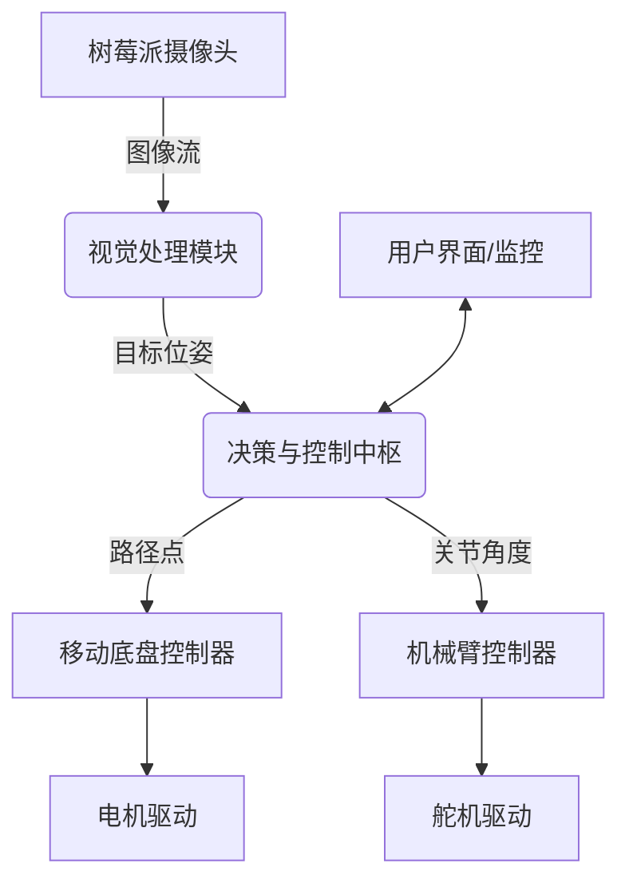

# 基于树莓派的视觉引导移动操作机器人：构建与控制逻辑

## 摘要
本文介绍了一种基于树莓派的视觉引导移动操作机器人系统的完整构建方案。系统整合了树莓派4B作为主控制器，OpenCV计算机视觉模块，六自由度机械臂与移动底盘，实现了目标识别、定位抓取和自主移动的闭环控制。本文详细阐述了硬件选型、软件架构、视觉处理算法、运动控制逻辑以及系统集成方法，为机器人爱好者提供了一套可复现的技术方案。

**关键词**：树莓派；计算机视觉；机械臂控制；移动机器人；ROS；OpenCV

---

## 1. 引言
随着嵌入式计算能力的提升和开源硬件生态的成熟，构建功能复杂的智能机器人系统已成为创客和研究人员可行的目标。树莓派以其出色的性价比、完善的GPIO接口和活跃的社区支持，成为机器人开发的首选平台之一。

本文所述项目旨在构建一个能够通过视觉识别目标物体，自主导航至目标位置，并操作机械手完成抓取任务的移动机器人。该系统综合体现了感知、决策与执行三个核心机器人技术模块，具有较高的教学与研究价值。

## 2. 系统整体架构

### 2.1 硬件组成
| 模块 | 型号/规格 | 功能 |
|------|-----------|------|
| **主控制器** | 树莓派4B (4GB RAM) | 系统大脑，运行视觉算法与主控制逻辑 |
| **视觉传感器** | 树莓派官方摄像头模块 v2 | 采集图像，进行目标识别与定位 |
| **机械臂** | 六自由度舵机机械臂 (如UArm、DIY型) | 执行抓取、放置等操作任务 |
| **移动底盘** | 双轮差分驱动底盘 + L298N电机驱动 | 提供机器人移动能力 |
| **电源系统** | 12V锂电池组 + 多路降压模块 | 为各组件提供稳定电压 |

### 2.2 软件栈
- **操作系统**: Raspberry Pi OS (64-bit)
- **中间件**: ROS 2 Humble（可选，用于模块化通信）
- **核心库**:
    - OpenCV 4.x: 图像处理与视觉算法
    - NumPy: 数值计算
    - RPi.GPIO / pigpio: 树莓派GPIO控制
    - PySerial: 串口通信（用于与下位机交互）

### 2.3 系统框图


## 3. 视觉模块设计与实现

### 3.1 摄像头标定
获取摄像头的内参矩阵和畸变系数，是进行精确定位的前提。
```python
import cv2
import numpy as np

# 示例：使用棋盘格进行标定
def calibrate_camera(images, pattern_size=(9,6)):
    objpoints = []  # 3D点（世界坐标系）
    imgpoints = []  # 2D点（图像坐标系）
    
    # 生成对象点 (0,0,0), (1,0,0), (2,0,0) ....
    objp = np.zeros((pattern_size[0]*pattern_size[1], 3), np.float32)
    objp[:,:2] = np.mgrid[0:pattern_size[0], 0:pattern_size[1]].T.reshape(-1,2)
    
    for img in images:
        gray = cv2.cvtColor(img, cv2.COLOR_BGR2GRAY)
        ret, corners = cv2.findChessboardCorners(gray, pattern_size, None)
        if ret:
            objpoints.append(objp)
            imgpoints.append(corners)
    
    ret, mtx, dist, rvecs, tvecs = cv2.calibrateCamera(objpoints, imgpoints, gray.shape[::-1], None, None)
    return mtx, dist
```

### 3.2 目标识别与定位
采用颜色阈值分割与轮廓检测方法，结合PNP解算获得目标相对于摄像头的位置。
```python
def detect_and_locate(frame, camera_matrix, dist_coeffs):
    # 转换为HSV颜色空间，进行颜色过滤
    hsv = cv2.cvtColor(frame, cv2.COLOR_BGR2HSV)
    lower_color = np.array([25, 50, 50])  # 示例：黄色下限
    upper_color = np.array([35, 255, 255]) # 黄色上限
    mask = cv2.inRange(hsv, lower_color, upper_color)
    
    # 形态学操作去除噪声
    kernel = np.ones((5,5), np.uint8)
    mask = cv2.morphologyEx(mask, cv2.MORPH_OPEN, kernel)
    
    # 查找轮廓
    contours, _ = cv2.findContours(mask, cv2.RETR_EXTERNAL, cv2.CHAIN_APPROX_SIMPLE)
    
    if contours:
        # 找到最大轮廓
        largest_contour = max(contours, key=cv2.contourArea)
        if cv2.contourArea(largest_contour) > 500:  # 面积阈值
            # 获取最小外接矩形
            rect = cv2.minAreaRect(largest_contour)
            box = cv2.boxPoints(rect)
            box = np.int0(box)
            
            # 已知目标物体尺寸（单位：米）
            object_points = np.array([
                [-0.05, -0.05, 0],
                [0.05, -0.05, 0],
                [0.05, 0.05, 0],
                [-0.05, 0.05, 0]
            ], dtype=np.float32)
            
            # 解算位姿（假设目标在平面Z=0上）
            ret, rvec, tvec = cv2.solvePnP(object_points, box.astype(np.float32), 
                                          camera_matrix, dist_coeffs)
            return True, rvec, tvec, box
    return False, None, None, None
```

## 4. 运动控制模块

### 4.1 移动底盘控制逻辑
采用差分驱动模型，实现基于目标点的位置控制。
```python
class MobileBaseController:
    def __init__(self, wheel_radius, wheel_base):
        self.wheel_radius = wheel_radius
        self.wheel_base = wheel_base  # 两轮间距
        
    def calculate_wheel_speeds(self, linear_x, angular_z):
        """
        根据线速度和角速度计算左右轮转速
        """
        left_speed = linear_x - (angular_z * self.wheel_base) / 2.0
        right_speed = linear_x + (angular_z * self.wheel_base) / 2.0
        
        # 转换为PWM占空比
        left_pwm = left_speed / self.wheel_radius
        right_pwm = right_speed / self.wheel_radius
        
        return left_pwm, right_pwm
    
    def navigate_to_point(self, current_pose, target_point, kp_linear=0.5, kp_angular=1.0):
        """
        简单的P控制导航到目标点
        """
        dx = target_point[0] - current_pose[0]
        dy = target_point[1] - current_pose[1]
        distance = np.sqrt(dx**2 + dy**2)
        
        # 目标朝向角
        target_angle = np.arctan2(dy, dx)
        angle_error = target_angle - current_pose[2]
        
        # 归一化角度误差到[-pi, pi]
        angle_error = np.arctan2(np.sin(angle_error), np.cos(angle_error))
        
        # 计算控制量
        linear_speed = kp_linear * distance
        angular_speed = kp_angular * angle_error
        
        return linear_speed, angular_speed
```

### 4.2 机械臂逆运动学与控制
以六自由度机械臂为例，实现简单的几何法逆解。
```python
import math

class Simple6DOFIK:
    def __init__(self, link_lengths):
        self.l1, self.l2, self.l3 = link_lengths
        
    def calculate_angles(self, target_position):
        x, y, z = target_position
        
        # 关节1：基座旋转（绕Z轴）
        theta1 = math.atan2(y, x)
        
        # 投影到平面上的距离
        r = math.sqrt(x**2 + y**2) - self.l1
        d = math.sqrt(r**2 + z**2)
        
        # 余弦定理求解关节2和3
        # 这里省略详细推导，实际需根据机械臂具体结构实现
        # 返回关节角度列表
        return [theta1, theta2, theta3, 0, 0, 0]  # 示例返回值
```

## 5. 系统集成与控制逻辑

### 5.1 状态机设计
使用有限状态机管理机器人的工作流程，确保任务有序执行。
```python
from enum import Enum

class RobotState(Enum):
    IDLE = 0
    SEARCHING = 1
    APPROACHING = 2
    ALIGNING = 3
    GRASPING = 4
    RETREATING = 5
    ERROR = 99

class RobotController:
    def __init__(self):
        self.state = RobotState.IDLE
        self.target_position = None
        
    def run(self):
        while True:
            if self.state == RobotState.IDLE:
                self.state = RobotState.SEARCHING
                
            elif self.state == RobotState.SEARCHING:
                # 寻找目标
                found, rvec, tvec, _ = detect_and_locate(frame, mtx, dist)
                if found:
                    self.target_position = tvec.flatten()
                    self.state = RobotState.APPROACHING
                    
            elif self.state == RobotState.APPROACHING:
                # 移动至目标附近
                distance = np.linalg.norm(self.target_position)
                if distance < 0.3:  # 30cm内
                    self.state = RobotState.ALIGNING
                else:
                    # 发送移动指令
                    linear_speed = min(0.2, distance * 0.5)
                    # ... 控制底盘移动
                    
            elif self.state == RobotState.ALIGNING:
                # 精确对准目标
                # ... 精确控制逻辑
                if aligned:
                    self.state = RobotState.GRASPING
                    
            elif self.state == RobotState.GRASPING:
                # 执行抓取
                arm_angles = arm_ik.calculate_angles(self.target_position)
                # ... 控制机械臂
                if grasp_success:
                    self.state = RobotState.RETREATING
                    
            # ... 其他状态处理
            
            time.sleep(0.1)  # 控制循环频率
```

### 5.2 通信架构
- **内部通信**: 使用Python multiprocessing或ROS 2话题/服务进行模块间数据交换
- **硬件通信**:
  - 舵机: PWM信号通过GPIO或PCA9685模块控制
  - 电机: L298N通过GPIO的PWM信号控制
  - 可选下位机: Arduino通过串口接收高级指令，负责底层实时控制

## 6. 系统测试与优化

### 6.1 测试项目
1. **视觉精度测试**: 测量不同距离下目标定位的误差
2. **移动精度测试**: 机器人移动至指定位置的重复定位精度
3. **抓取成功率测试**: 在不同位置、姿态下的抓取成功率
4. **系统稳定性测试**: 长时间运行的稳定性与故障率

### 6.2 常见问题与解决方案
| 问题 | 可能原因 | 解决方案 |
|------|---------|----------|
| 视觉识别不稳定 | 光照变化影响 | 使用自适应阈值或深度学习模型 |
| 机械臂抓取不准 | 运动学模型误差 | 进行手眼标定，加入视觉伺服 |
| 移动路径振荡 | 控制参数不当 | 调整PID参数，加入死区控制 |
| 系统延迟大 | 树莓派计算负载高 | 优化算法，使用多线程，考虑硬件加速 |

## 7. 结论与展望
本文提出并实现了一套基于树莓派的视觉引导移动操作机器人系统。该系统成功整合了视觉感知、移动导航和机械臂操作功能，形成了一个完整的自主作业闭环。实验表明，系统能够稳定识别特定目标，自主导航至目标位置，并完成抓取任务。

未来的改进方向包括：
1. **算法升级**: 采用深度学习进行目标检测与识别，提高鲁棒性
2. **硬件优化**: 引入IMU进行姿态估计，使用更精密的机械结构
3. **功能扩展**: 增加SLAM能力，实现未知环境下的自主导航与建图
4. **交互改进**: 开发可视化人机界面，支持任务编程与远程监控


---
